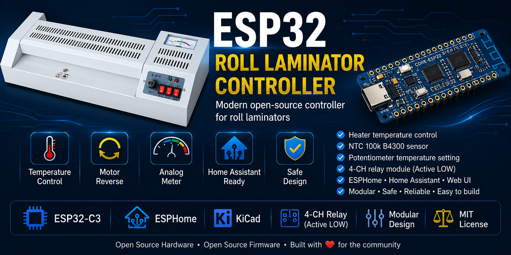
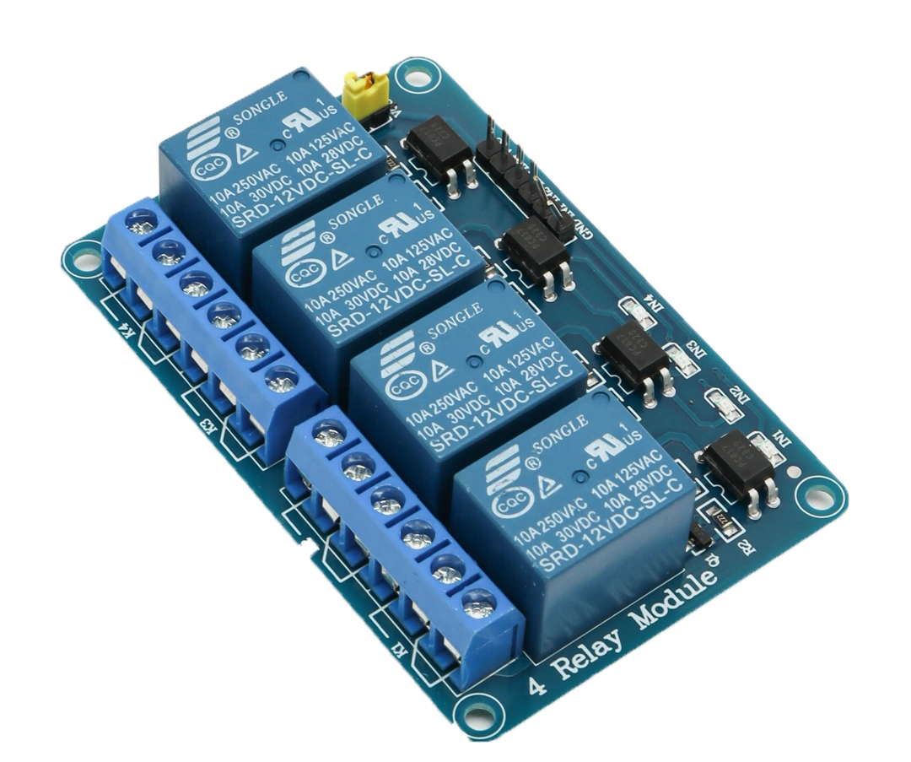

# ESP32 Roll Laminator Controller

[Русская версия](README_ru.md)



Modern open-source controller for roll laminators based on ESP32-C3 and ESPHome.


Modern replacement controller for inexpensive roll laminators based on **ESP32-C3** and **ESPHome**.

The project replaces the original controller board with a fully programmable, modular, and repairable solution built from standard components.

---

## Project Goals

- High reliability
- Electrical safety
- Easy maintenance and repair
- Use of widely available components
- Complete separation of high-voltage and low-voltage circuits
- Home Assistant integration
- Open-source hardware and firmware

---

## Current Status

**Version:** 1.0

✔ Hardware completed

✔ ESPHome firmware completed

✔ Control algorithms completed

✔ Preliminary temperature calibration completed

⏳ Fine temperature calibration and long-term testing remain.

---

## Main Features

- Heater temperature control
- Motor forward / reverse control
- Temperature adjustment using a potentiometer
- Analog temperature meter support
- Two status LEDs (PREHEAT / WORK)
- NTC 100k B4300 temperature sensor
- Home Assistant integration through ESPHome
- Simple modular architecture
- Standard relay module support
- Easy assembly on perfboard

---

## Safety

The controller was designed with electrical safety as one of its primary goals.

Unlike the original controller board, **all high-voltage (220 VAC) circuitry has been removed from the control electronics**.

The ESP32 board, switches, potentiometer, LEDs, and temperature sensor operate exclusively from **3.3 V / 5 V**.

The only part connected to mains voltage is the external **4-channel relay module**, which switches:

- Heater
- Motor power
- Motor direction

This architecture significantly improves safety, simplifies debugging, and makes future repairs much easier.

---

## Hardware

Controller:

- ESP32-C3 LuatOS Core

Temperature sensor:

- Glass NTC 100k B4300

Voltage regulator:

- AMS1117-3.3

Relay module:#

- Standard 4-channel relay board
- Active LOW inputs

---

## GPIO Mapping

| GPIO | Function |
|------|----------|
| GPIO0 | NTC temperature sensor |
| GPIO1 | Potentiometer |
| GPIO2 | MASTER switch |
| GPIO3 | SEAL switch |
| GPIO4 | Heater relay |
| GPIO5 | Reverse relay |
| GPIO6 | Direction switch |
| GPIO7 | Analog meter (PWM) |
| GPIO20 | PREHEAT LED |
| GPIO21 | WORK LED |

Unused GPIO:

- GPIO8
- GPIO9
- GPIO12
- GPIO13
- GPIO18
- GPIO19

---

## Relay Module

  

The project uses a standard **4-channel Active LOW relay module**.

Logic:

- GPIO LOW → Relay ON
- GPIO HIGH → Relay OFF

ESPHome configuration:

- `inverted: true`
- `restore_mode: ALWAYS_OFF`

This guarantees that all relays remain OFF immediately after power-up or reset.

---

## Repository Structure

```
Firmware/
    ESPHome YAML

Hardware/
    Schematics
    PCB
    KiCad project

Documentation/
    Technical specification
    Calibration notes

Images/
    Photos
    Schematics
```

---

## Requirements

- ESPHome
- Home Assistant (optional)
- ESP32-C3
- 5V power supply
- Standard 4-channel relay module

---

## Future Improvements

- Final temperature calibration
- Long-term reliability testing
- PCB revision
- Optional WS2812 status indicator
- Additional Home Assistant entities

---

## License

This project is released under the MIT License.

Feel free to use, modify and improve it.
